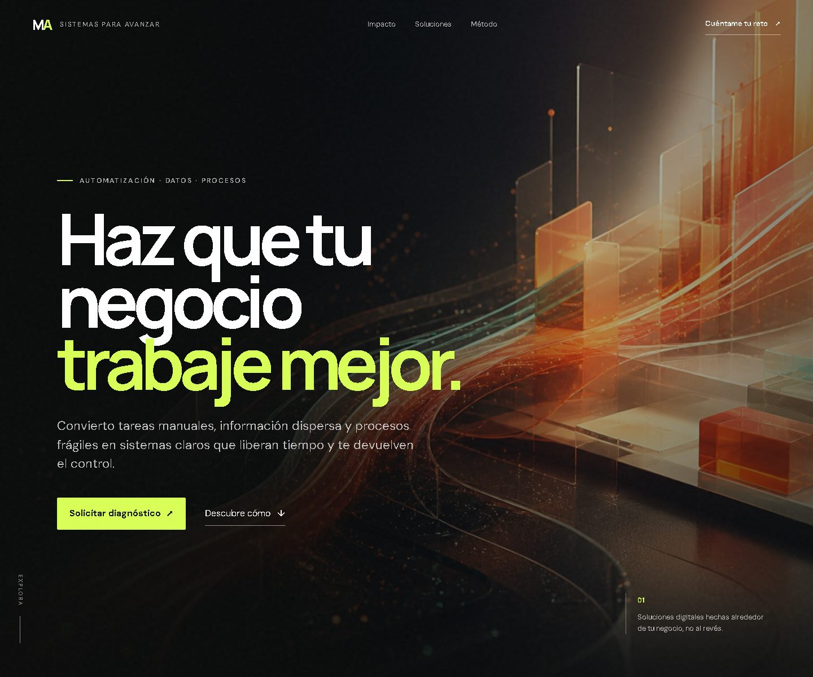

# CanVidaWeb

<p align="center">
  <strong>Web comercial multilingüe de MA · Automatización, datos y procesos para pequeñas empresas.</strong>
</p>

<p align="center">
  <a href="https://mauricio-acuna.github.io/canvidaweb/"><strong>Ver la web publicada →</strong></a>
</p>

<p align="center">
  <a href="https://mauricio-acuna.github.io/canvidaweb/">Castellano</a> ·
  <a href="https://mauricio-acuna.github.io/canvidaweb/ca/">Català</a> ·
  <a href="https://mauricio-acuna.github.io/canvidaweb/en/">English</a>
</p>

<p align="center">
  
  
  
</p>

[](https://mauricio-acuna.github.io/canvidaweb/)

## Vista pública

La versión publicada está disponible en **[mauricio-acuna.github.io/canvidaweb](https://mauricio-acuna.github.io/canvidaweb/)**.

| Idioma | URL pública |
| --- | --- |
| Castellano | [Abrir versión ES](https://mauricio-acuna.github.io/canvidaweb/) |
| Català | [Obrir versió CA](https://mauricio-acuna.github.io/canvidaweb/ca/) |
| English | [Open EN version](https://mauricio-acuna.github.io/canvidaweb/en/) |

## Sobre el proyecto

CanVidaWeb es la página principal de contacto de MA. Está diseñada para convertir visitas de pymes, profesionales y negocios locales en conversaciones comerciales sobre automatización y mejora de procesos.

La propuesta de valor se articula alrededor de un problema concreto: diseñar sistemas orientados a reducir tareas manuales, ordenar información dispersa y mejorar el control. Los resultados se miden en cada intervención; la web no promete un ahorro predeterminado.

El recorrido de la página conduce al visitante por cinco etapas:

1. Propuesta de valor inmediata.
2. Coste real de la fricción operativa.
3. Soluciones y resultados esperados.
4. Método de trabajo sencillo y comprensible.
5. Contacto directo mediante llamadas a la acción contextuales.

## Características

- Diseño comercial responsive para escritorio, tableta y móvil.
- Versiones completas en castellano, catalán e inglés.
- Selector de idioma accesible y funcional sin JavaScript.
- Metadatos específicos por idioma para buscadores y redes sociales.
- Etiquetas `canonical`, `hreflang` y `x-default` para SEO internacional.
- Navegación por secciones y enlaces de contacto `mailto:` contextualizados.
- Animaciones progresivas y contadores mediante `IntersectionObserver`.
- Compatibilidad con `prefers-reduced-motion`.
- Contenido principal disponible aunque JavaScript esté desactivado.
- Imagen editorial optimizada para reducir el tiempo de carga.
- Sin formulario servidor ni herramienta analítica implementada en el código del sitio.
- El contacto abre el cliente de correo mediante `mailto:`; el envío y tratamiento posterior dependen de los proveedores de correo y de la política de privacidad aplicable.
- Las tipografías se cargan actualmente desde Google Fonts, por lo que el navegador realiza conexiones a terceros; está pendiente decidir entre autoalojarlas o documentar/evaluar esa dependencia.

## Tecnología

La web utiliza HTML, CSS y JavaScript nativos. No requiere frameworks, dependencias, gestor de paquetes ni proceso de compilación.

La única dependencia remota visible en el código es Google Fonts. Esta afirmación debe volver a verificarse con las herramientas de red del navegador después de cada cambio.

```text
canvidaweb/
├── index.html                    # Versión en castellano
├── ca/
│   └── index.html                # Versión en catalán
├── en/
│   └── index.html                # Versión en inglés
├── assets/
│   ├── hero-transformation.jpg   # Imagen principal optimizada
│   └── site-preview.jpg          # Captura para la documentación
├── styles.css                    # Diseño, responsive y animaciones
├── script.js                     # Interacciones y contadores
└── README.md                     # Documentación del proyecto
```

## Ejecutar en local

No es necesario instalar nada. Desde la raíz del repositorio:

```bash
python -m http.server 8000
```

Después abre [http://localhost:8000](http://localhost:8000). También puedes abrir `index.html` directamente en el navegador.

## Publicación

El sitio se despliega con GitHub Pages desde la raíz de la rama `main`:

- Repositorio: [github.com/mauricio-acuna/canvidaweb](https://github.com/mauricio-acuna/canvidaweb)
- Rama de publicación: `main`
- Carpeta de publicación: `/`
- HTTPS: activado

Cada `push` a `main` genera una nueva publicación de la web.

## Mantenimiento

Al modificar contenido o diseño:

1. Mantén equivalentes las versiones `ES`, `CA` y `EN`.
2. Revisa enlaces internos, selector de idioma y correos de contacto.
3. Comprueba la presentación en móvil y escritorio.
4. Optimiza cualquier imagen antes de incorporarla.
5. Verifica que el contenido principal siga siendo accesible sin JavaScript.
6. Confirma las tres URL públicas después del despliegue.

## Privacidad

Este repositorio público contiene únicamente los archivos necesarios para la web. No deben añadirse credenciales, datos de clientes, documentos internos ni materiales privados.

## Contacto

Consultas profesionales: [mauricio.acuna@proton.me](mailto:mauricio.acuna@proton.me)
